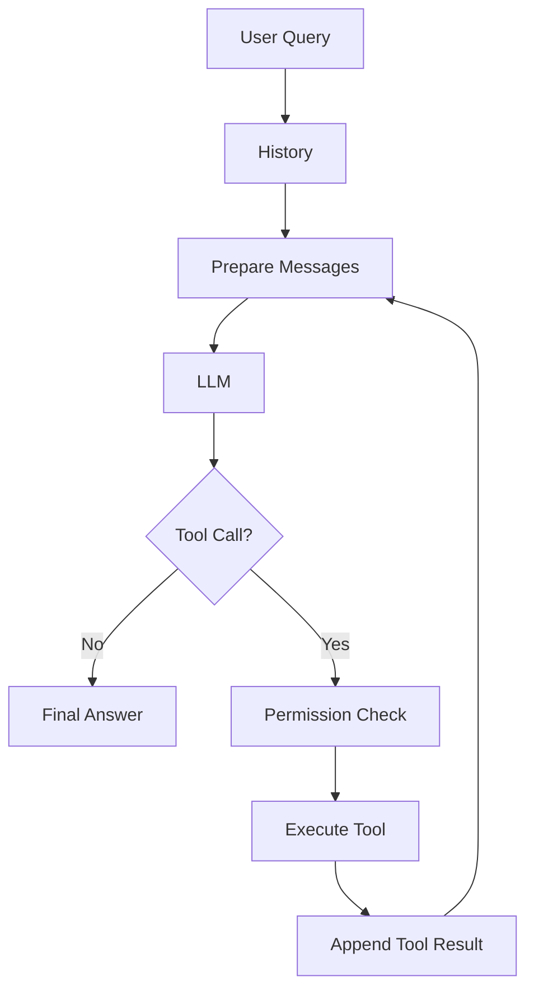
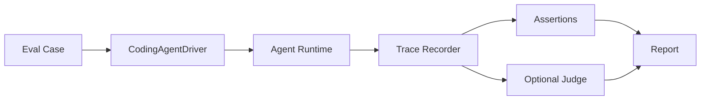

# 网页版教程规划：用 Prompt 重建一个 TypeScript Coding Agent

## 1. 文档目的

本文是后续生成网页版教程的总蓝图。未来发布时，当前 `doc/` 下的 PDD、重构记录、阶段性工作文档可能会被删除、隐藏或大幅简化；学生主要阅读本教程，而不是阅读这些内部设计文档。

因此，教程必须自洽：学生克隆项目后，只需要启动本地 web 服务，就能在浏览器中读完 HTML 版教程，理解一个 coding agent harness 是如何从最小 loop 一步步长出来的，并能用自己的话写出 prompt，让另一个 coding agent 重建类似项目。

教程不是源码手册，也不是 API 使用文档。它的核心目标是训练学生形成“架构 prompt 能力”：

- 能描述真实场景：为什么需要这个模块，它解决 agent loop 中哪个痛点。
- 能讲清设计：模块职责、边界、数据流、状态流、依赖注入位置。
- 能预判例外：失败模式、corner case、安全边界、长期运行风险。
- 能提出验证：单元测试、集成测试、live smoke、trace、手工 query。
- 能写出 prompt：把场景、设计、边界、测试和文档同步要求组织成可执行任务。

## 2. 项目定位与致谢

教程开头必须说明：本项目受到 `shareAI-lab/learn-claude-code` 的启发，并向原项目作者表示感谢。

建议首页文案方向：

> 这个教程受到 `shareAI-lab/learn-claude-code` 启发。原项目用非常清晰的方式展示了 Claude Code 一类 coding agent 的核心思想：真正需要我们构建的，不是另一个大模型，而是承载模型工作的 harness，也就是 loop、工具、上下文、权限、记忆、任务、调度和验证系统。
>
> 本项目是这个思路的 TypeScript Coding Agent 教程本。我们不追求生产级复杂度，而是追求让学生一步步看懂：一个 coding agent 为什么会这样长出来。

不要把致谢写成脚注。它应该出现在首页第一屏或第一章开头，因为这决定了项目的思想来源和读者预期。

## 3. 教学目标

学生完成教程后，应获得三类能力。

### 3.1 架构理解

学生应能画出并解释主循环：

```text
user query
  -> append to history
  -> build stable system prompt / dynamic reminders / tools / messages
  -> call LLM
  -> receive assistant message or tool calls
  -> check permission
  -> execute tool
  -> append tool result
  -> normalize / compress / recover when needed
  -> loop until final answer
```

并能说明每个后续模块是在这个 loop 的哪个位置插入的。

### 3.2 Prompt 重建能力

学生应能把每一章最终整理成一张 `Prompt Card`，用于指导 coding agent 实现同类功能。Prompt Card 必须包括：

- 目标：要实现什么能力。
- 背景：为什么当前 loop 不够用。
- 设计：新增哪些模块、职责如何拆分。
- 接线：在 composition root、agent loop、tool registry、permission、tests、docs 中分别改什么。
- 边界：明确不做什么，避免实现失控。
- 例外：列出 corner case 和常见错误。
- 验证：指定测试文件、手工 query、trace 或日志观察点。
- 文档同步：要求更新教程或 summary，而不是只改代码。

### 3.3 验收思维

学生应理解：agent 功能不能只靠“跑了一次看起来对”来验收。需要分层验证：

- deterministic tests：用 fake/scripted LLM 验证 harness 逻辑。
- core tool tests：验证工具参数、权限、路径、安全边界。
- integration tests：验证 agent loop、history、tool result、reminder、compression 的组合。
- live smoke：用真实模型观察行为，但不作为默认硬门禁。
- eval trace：用结构化事件记录事实，而不是事后猜测模型做了什么。
- judge：只做语义补充，不替代硬断言。

## 4. 内容组织原则

### 4.1 以 loop 为主线

每章都必须回答：

1. 这一章之前，agent loop 遇到了什么现实问题？
2. 这一章新增的模块插在 loop 的哪里？
3. 新模块如何改变下一轮 LLM 调用、工具执行或状态保存？
4. 哪些消息、状态、文件、权限边界不能被破坏？

不要按“功能列表”写成手册。例如不要直接写：

```text
本章新增 run_task_group_create、run_task_group_list、run_task_group_read...
```

应该改成：

```text
当任务跨越多个会话时，TODO 已经不够用了。TODO 是本轮执行清单，而 Task Group 是长期计划。我们要把长期计划落盘，让 agent 下次启动后还能知道这个项目有哪些未完成工作。
```

### 4.2 以 vibe coding 为目标读者

未来很多学生会通过 vibe coding 构建应用。他们不一定需要记住每个函数怎么写，但必须知道如何向 coding agent 下达好任务。

所以教程中的代码应作为“观察架构的证据”，不要成为主角。每章只讲关键结构和关键边界：

- 可以展示核心接口、数据结构、伪代码、调用链。
- 可以在正文中穿插少量关键代码片段，但代码必须服务于理解 loop、接口、模块边界和状态流。
- 不逐行解释实现，也不把源码细节当作章节主线。
- 不把测试文件完整贴出来。
- 把实现细节放在折叠区或“深入阅读”中。
- 每章最终落到 Prompt Card 和验收清单。

### 4.3 默认读者与内容焦点

默认读者不是完全零基础用户，而是有编程经验、想理解 coding agent 运行原理的同学。他们可能会写 TypeScript、会读代码、会使用 coding agent，但还没有建立 agent harness 的架构图。

这意味着教程可以假设读者知道：

- 什么是函数、模块、接口、异步调用、JSON、HTTP API。
- 什么是命令行、文件系统、测试、环境变量。
- 大模型可以根据 prompt 生成文本。

但不能假设读者已经知道：

- coding agent 为什么不是一次普通聊天请求。
- tool call、tool result、history、transcript、system prompt、reminder 分别是什么。
- 为什么 LLM 是无状态的，为什么每次请求都要重新组织 messages。
- 为什么 agent 需要 think → act → observe loop，而不是简单 `await llm.chat(query)`。
- 为什么权限、压缩、持久化、eval 都属于 harness，而不是“模型自己会处理”。

因此每章内容要避免两个极端：

- 不要写成面向最终用户的功能介绍。
- 不要写成面向维护者的源码逐行讲解。

正确焦点是：让读者理解“如果我要用 prompt 让另一个 coding agent 实现这一章，我必须讲清哪些设计”。每章都应覆盖：

- 场景：本章解决 agent loop 中哪个现实问题。
- 原理：这个问题为什么不能靠一次 LLM 调用自然解决。
- 流程：loop 中每个环节发生什么，新增模块插在哪里。
- 接口：关键 interface、数据结构、伪码或调用链。
- 源码：指向少量核心源码文件，帮助读者按图索骥。
- 例外：实现时最容易漏掉的 corner case。
- 验证：如何证明本章 agent 行为真的正确，而不是只证明页面写得好。

尤其要避免一个内容 bug：Prompt Card、Design Trap、Validation Card 不能写成“如何生成教程”“如何考核学生”“如何组织章节”。它们必须面向本章要实现的 agent 能力。例如第 0/1 章应讨论“如何实现并验证最小 agent loop”，而不是讨论“如何搭建教程骨架”。

### 4.4 内容厚度要求

当前教程样章暴露出的主要风险是内容太薄：如果读者已经懂 coding agent，会觉得它顺；如果读者只是有编程经验但不懂 agent harness，就会觉得许多概念跳得太快。后续章节必须显著增加解释密度，但这种“详细”不是堆代码，而是补齐读者建立心智模型所需的中间台阶。

每章正文至少要包含以下几层解释：

1. **问题现场**：用一个真实用户 query 或真实工程任务开场，让读者知道“为什么现在的 agent 不够用”。
2. **朴素方案**：先说一个程序员容易想到的简单做法，例如“直接把 query 发给 LLM”“直接执行模型输出的 shell 字符串”“直接截断旧消息”。
3. **朴素方案为什么坏**：说明它在哪些场景会失败，最好给出具体失败样例。
4. **新概念解释**：第一次出现的核心术语必须解释，例如 tool call 是模型提出的结构化动作请求，不是本地函数真的已经执行。
5. **运行 walkthrough**：用 5-8 步把一次真实运行走完，明确每一步读写了什么状态、调用了什么模块、产生了什么消息。
6. **关键接口/伪码**：展示少量接口、数据结构或伪码，让读者能把概念映射到工程形状。
7. **源码地图**：指向核心源码文件，并告诉读者只看哪些入口，不要求读完整个文件。
8. **边界和坑**：解释容易犯的设计错误，以及为什么这些错误会在后续章节放大。
9. **验证叙事**：不仅列测试名，还要讲“这个测试证明了哪个行为事实”。
10. **Prompt Card**：把本章能力浓缩成可交给 coding agent 的实现任务。

每章需要回答这些细节问题：

- 本章新增能力之前，最小 agent 的输入、输出、状态分别是什么？
- 本章新增能力之后，哪条数据流变了？
- 这次改动发生在 loop 的哪一段：构建 messages 前、LLM 返回后、工具执行前、结果写回后，还是跨会话存储层？
- 哪些状态是 session-local，哪些状态需要持久化？
- 如果本章模块失败，agent 应该返回可恢复错误、停止本轮，还是写入提醒让下一轮继续？
- 如果读者只看一个源码函数，应该看哪个？为什么？

建议篇幅：主线章节不要少于“一个完整解释页”的厚度。短章节也应有完整的场景、walkthrough、接口、坑点和验证；复杂章节可以拆成多个小节，而不是压缩成概念列表。

### 4.5 讲课顺序硬规则：先原理，再实现

后续所有章节都必须遵循同一种课堂逻辑，避免学生“一头雾水”：

1. 先用真实 query 或真实工程任务说明为什么需要本章能力。
2. 再讲学生自然会想到的朴素方案。
3. 再说明朴素方案为什么坏，最好给出具体失败样例。
4. 再讲核心原理或心智模型，用图示说明新增模块插在 loop 的哪一段。
5. 再给推荐架构方案，说明稳定边界、动态边界、状态归属和依赖注入位置。
6. 然后才进入实现：接口、伪码、源码地图、关键测试。
7. 最后用 Prompt Card、Design Trap、Validation Card 收束成可复制的实现任务。

尤其是涉及底层机制的章节，例如 Prompt Cache、模型适配、Eval、Permission、Async Run、Schedule，不能一上来列模块和函数。必须先讲“为什么这个问题会出现”“不处理会怎样坏”“好的设计长什么样”，然后才讲代码。

每章都应尽量图文并茂。图不是装饰，而是帮助学生建立架构意识：

- 数据流图：说明 user query、history、messages、tool result、reminder 如何流动。
- 分层图：说明 stable prefix / dynamic tail、core tool / provider tool、session-local / persistent state 等边界。
- 生命周期图：说明 task、async run、schedule occurrence、eval case 从创建到终态的状态转移。
- 对比图：说明朴素方案和推荐方案的差异。

### 4.6 Prompt Cache 章节的特殊写作要求

第 10 章必须按下面顺序讲：

1. 先讲 LLM prompt cache hit 的大概原理：provider 复用相同 prompt 前缀的计算结果；这不是语义缓存，而是前缀/token/结构缓存。
2. 讲随意改变 prompt 结构的影响：system prompt 前面插入时间戳、TODO、hook reminder，或工具定义顺序变化，都会破坏 exact prefix；性能上可能影响首 token 延迟和输入 token 成本。
3. 给量化感知：OpenAI 文档给出最高约 80% 延迟下降和最高约 90% 输入 token 成本下降的量级；Anthropic 显式 cache breakpoint 有 cache write/read 成本差异；Gemini 区分 implicit caching 和 explicit context caching。正文可以概括量级，但不要伪造具体账单。
4. 用图示表达一次 agent 请求的组成：system prompt snapshot、tool definitions、stable context、history、dynamic reminders、tool results / working evidence。
5. 给本项目推荐方案：稳定内容在会话开始形成 snapshot，动态内容在每轮作为 messages/reminders 追加；cache-debug 只观察本地 prefix hash，不等于 provider 真实 cache hit。
6. 最后才讲实现文件：`system-prompt.ts`、`session-events.ts`、`cache-debug.ts`、`tools/registry.ts`、`agent.ts`、`stable-context.ts`。

本章常见错误要具体写出来：

- 把 timestamp、当前轮次、TODO 状态放进 system prompt 开头。
- memory/skill 变化后立即重写完整 system prompt。
- 根据 permission mode 动态隐藏工具定义，导致 tools schema 不稳定。
- 把本地 cache hash 当作真实计费命中率。
- 把 provider-specific cache 参数散落在 agent loop，而不是放进 adapter / runtime policy。

验证也要围绕 agent 行为，而不是页面质量：

- 多轮没有结构变化时，system/tools/prefix hash 保持稳定。
- memory 或 hook 变化后，模型能通过 reminder 得知变化，但 stable snapshot 不被重写。
- 子智能体复用父 stable snapshot。
- 真实 provider 测试中，若可用，观察 usage 中的 cached token 字段或控制台指标，但它不是 deterministic 测试的硬门禁。

### 4.7 循循善诱

写作顺序从学生的直觉出发：

1. 先给场景。
2. 再给一个朴素但有缺陷的实现想法。
3. 再暴露当前 agent 做不到的地方。
4. 再提出设计。
5. 再用流程图、接口或伪码解释关键结构。
6. 再跑一遍真实执行 walkthrough。
7. 再讨论坑。
8. 最后给 prompt 和验证。

不要一上来讲抽象名词。术语第一次出现时，要用生活化的比喻或小例子解释。

### 4.8 自洽，不依赖 PDD

发布版教程不能假设读者能看到 `doc/pdd*.md`。PDD 只能作为作者生成教程时的素材来源，不能作为学生必须点击的外部依赖。

允许在教程末尾保留“设计来源”说明，但正文必须完整覆盖学习所需信息。

## 5. 建议站点形态

学生克隆项目后，应能在本地运行一个 web 服务阅读教程。推荐结构：

```text
tutorial/
  package.json
  index.html 或 docs 框架入口
  src/ 或 docs/
    index.md
    guide/
      00-preface.md
      01-agent-loop.md
      02-tools.md
      ...
      15-runtime-hardening.md
    model-policy/
      index.md
      01-foundation-model-profile.md
      02-runtime-policy.md
      03-context-budget.md
      04-adapter-and-reasoning.md
    eval/
      index.md
      01-deterministic-first.md
      02-driver-trace-assertion.md
      03-live-regression-and-judge.md
      04-mcp-and-agent-team.md
    reference/
      glossary.md
      prompt-pack.md
      architecture-map.md
      validation-playbook.md
```

也可以直接使用 `docs/` 或 `site/`，但建议避免与现有 `doc/` 工作文档混淆。`tutorial/` 更清楚：这是面向学生的发布内容。

### 5.1 本地运行体验

理想命令：

```bash
cd tutorial
npm install
npm run dev
```

或在仓库根目录暴露：

```bash
npm run tutorial:dev
```

访问地址示例：

```text
http://localhost:5173
```

具体技术栈可以使用 VitePress、Docusaurus、Astro 或轻量自建 Markdown 站点。优先级不是“炫”，而是：

- Markdown 编写体验好。
- 目录导航清楚。
- 本地启动简单。
- 支持代码块、折叠区、提示框、自定义组件。
- 静态构建后可托管到 GitHub Pages 或任意静态站。

在真正选型和编码前，应再查当前框架文档，避免使用过期配置。

### 5.2 当前视觉与交互基准

当前视觉和交互应以 `web/temp/2/` 的 dummy 页面为基准。后续实现正式教程站点时，除非用户明确提出新方向，否则应优先复刻这个样张的整体观感、版式节奏和交互方式。

`web/temp/2/` 的关键特征：

- 固定顶部 header，包含站点标题、副标题和轻量主导航。
- 页面主体是三栏布局：左侧章节目录，中间正文，右侧本页小节目录。
- 三栏在桌面端独立滚动：`body` 不滚动，正文 `.article` 自己滚动，左右侧栏也自己滚动。
- 整体最大宽度受控，页面不是铺满全屏的 dashboard。
- 左右侧栏都有贴边的小箭头按钮，点击后只收起对应侧栏，按钮仍保留在边缘可再次展开。
- 侧栏收起状态保存在 `sessionStorage`，刷新后保留，关闭浏览器后重置。
- 支持调试友好的 query 参数，例如 `?collapse=left`、`?collapse=right`、`?collapse=both`、`?collapse=none`。
- 右侧页内目录点击时，不滚动浏览器 viewport，而是在中间 `.article` 滚动容器里做平滑滚动。
- 尊重 `prefers-reduced-motion`，用户偏好减弱动效时不做动画。
- 文末致谢跟随正文一起滚动，不做固定浮层。

这意味着第一版正式站点不应采用普通文档站默认的“整个页面滚动 + sticky sidebar”模型，而应采用 `web/temp/2/` 中的“固定 header + 三栏独立滚动”模型。

### 5.3 图文并茂，但不装饰化

教程应尽量图文并茂。这里的“图文并茂”不是指加入大量装饰插画，而是用图帮助学生建立架构直觉。

优先使用这些视觉材料：

- loop 高亮图：每章展示本章模块插入 agent loop 的位置。
- 数据流图：展示 user message、assistant message、tool call、tool result、reminder、transcript 的流动。
- 状态机图：用于 TODO、Task、Async Run、Schedule occurrence、Recovery。
- 存储布局图：展示 projectRoot、agentHome、tasks、schedules、outputs、logs 的边界。
- 对比图：展示 TODO vs Task、Skill vs Tool、History vs Transcript、Profile vs Policy。
- 小尺寸真实截图：用于展示本地教程站、终端输出、eval report，但只作为辅助证据。

视觉材料的原则：

- 图要解释结构，不要替代正文。
- 图的标题和 caption 必须能说明它解决了哪个理解问题。
- 每章至少有一张核心图；复杂章节可以有 2-3 张图。
- 不使用纯装饰性大图、渐变背景图、抽象科技插画。
- 不使用大面积暗色、强烈霓虹色、复杂阴影或过度动效。
- Mermaid 图可以作为第一版主要图表格式；后续如果需要更精致的图，可以逐步替换为静态 SVG 或组件化图表。

### 5.4 当前视觉风格

第一版网页视觉风格应极简、克制、学术感强。它应该像一个安静、严谨、个人化的学术研究者主页，而不是商业化作品集、SaaS 官网或科技公司发布页。

具体要求：

- 背景以 `web/temp/2/` 的暖米白为主，参考值为 `#f5f1e8`。
- 正文文字以深灰近黑为主，参考值为 `#26241f`；次要文字参考 `#6b6657`；极弱文字参考 `#9a9484`。
- 强调色使用温暖赭石色，参考值为 `#8a4a2b`，用于链接、active 状态、tag 和少量边框。
- 分隔线使用低对比细线，参考 `#d9d2bf`、`#e6e0cf`。
- 页面采用大量留白，阅读节奏舒缓。
- 内容区域较窄，正文行宽按中文长文控制，参考 `68ch`；单侧栏收起时可放宽到 `78ch`，两侧都收起时可放宽到 `92ch`。
- 标题层级明确但不夸张，不使用超大 hero 字号。
- 字体选择偏现代、干净、理性；当前基准使用低调中文无衬线字体栈，而不是强烈书卷气衬线。
- 导航栏轻量、安静，不抢正文注意力。
- 头像、截图或图片尺寸较小，只作为辅助元素出现。
- 不使用强烈装饰、复杂渐变、厚重阴影、玻璃拟态、大面积动效。
- 链接、提示框、代码块可以有轻微色彩区分，但整体色彩必须克制。
- 代码块可以使用深色底作为局部对比，但整页大面积背景仍保持暖米白。

当前推荐观感：

```text
warm off-white background
deep gray text
thin dividing lines
quiet side navigation
narrow reading column
small diagrams with captions
minimal cards for Prompt / Trap / Validation
```

### 5.5 中文内容优先

教程第一版只面向中文读者，暂时不提供英文版本，也不需要在页面上放语言切换入口。后续可以保留扩展 i18n 的工程可能性，但第一版不要为了未来多语言牺牲中文阅读体验。

中文排版要求：

- 可见导航、按钮、提示框、章节标题、图注、卡片标题都使用中文。
- 路由和文件名可以继续使用英文短名，便于工程维护；但页面展示名必须是中文。
- 字体栈要优先照顾中文长文阅读，不要只选择英文字体再让中文随机 fallback。
- 正文字号、行高和段落间距应按中文阅读优化；建议正文行高保持宽松，段落之间留出明确呼吸感。
- 中文段落不要过窄也不要过宽，正文行宽应让一行大约容纳适中的中文字数，避免读者频繁换行或扫读困难。
- 中英文混排时，术语第一次出现要给中文解释，例如 “tool call（工具调用）”；后续可使用固定中文译名。
- 标点使用中文标点；英文术语、代码名、命令名、文件名保持原样并使用等宽样式。
- 代码块和命令块可以保留英文关键字，但解释文字必须使用中文。
- 图表节点和 caption 优先使用中文；只有工具名、模块名、文件名等真实代码标识保留英文。

术语策略：

- 关键概念采用“中文主译名 + 必要英文原词”的方式，例如 “消息历史（History）”“原始事件流（Transcript）”“运行策略（Runtime Policy）”。
- 不要把整页写成中英双语对照，这会破坏阅读节奏。
- 不要默认使用英文文档站常见的短促口号式文案；中文正文要完整、自然、循循善诱。

### 5.6 便于未来调整视觉风格

网页实现必须便于未来调整视觉风格。不要把颜色、间距、圆角、字体、阴影直接散落在每个页面里。

实现时应优先采用：

- 集中的 theme config 或 CSS variables。
- 语义化设计 token，例如 `--color-bg`、`--color-text`、`--color-muted`、`--color-border`、`--content-width`。
- 中文友好的字体 token，例如 `--font-serif-zh`、`--font-sans-zh`、`--font-mono`。
- 布局 token，例如 `--layout-max`、`--sidebar-left-width`、`--sidebar-right-width`、`--header-height`、`--gutter`。
- 间距和字号 token，例如 `--space-*`、`--text-*`、`--leading-*`。
- 组件化的 Prompt Card、Design Trap、Validation Card、Figure、Loop Map。
- Markdown 内容和视觉组件分离，章节作者不需要手写复杂 HTML。
- 布局组件集中维护，例如 `TutorialLayout`、`ChapterNav`、`PageToc`、`Article`.
- 避免页面级 inline style；特殊样式应通过组件 prop 或 class name 表达。
- 正式实现时应把 `web/temp/2/styles.css` 里的 token 思路迁移到主题层，而不是把样张 CSS 原样复制到每个页面。

第一版可以只有中文主题和中文内容，但代码结构要允许未来替换：

- 字体方案，尤其是中文衬线/无衬线的切换。
- 背景和文字颜色。
- 图表样式。
- 卡片边框和提示框样式。
- 章节导航密度。
- 正文行宽和段落间距。

### 5.7 导航与阅读体验

教程站点的导航要服务长文阅读。

桌面端推荐布局：

```text
left sidebar        center article             right sidebar
chapter nav         narrow reading column      page toc
```

要求：

- 左侧是章节导航，展示主线教程、模型适配专题、Eval 专题、Reference。
- 右侧是当前页面内的小节导航，展示本页 H2/H3。
- 两边侧栏均可隐藏，避免学生专注阅读时受到干扰。
- 隐藏状态应保持在当前浏览会话中；当前基准使用 `sessionStorage`，未来可以再考虑本地持久化。
- 中间正文区域在侧栏隐藏后应自然扩展，但仍保持合适行宽；参考规则是正常 `68ch`，收起一侧 `78ch`，收起两侧 `92ch`。
- 侧栏收起按钮应像 `web/temp/2/` 一样贴近侧栏内边缘，收起后仍停留在布局边缘可点击。
- 收起按钮需要有明确的 `aria-expanded`、`aria-label` 和 `title`。
- 支持 `?collapse=left/right/both/none` 这类调试参数，方便视觉评审和截图比较。
- 右侧页内目录点击需要滚动中间正文容器，而不是滚动整个页面；如果实现使用独立滚动容器，必须接管锚点滚动。
- 平滑滚动要尊重 `prefers-reduced-motion`。
- 移动端可以简化：隐藏左侧章节栏和右侧小节栏，正文单栏展示；后续再做抽屉导航，不作为第一版样张硬要求。
- 当前章节、当前小节要有清楚但克制的 active 状态。
- 导航文字不要过长；必要时用短标题，正文中再展开解释。
- 导航文字应优先使用自然中文短标题，不要直接暴露英文文件名或 PDD 编号。
- 每个章节页面末尾必须有“上一章 / 下一章”翻页导航。这个导航属于站点框架能力，应根据章节元数据自动生成，不要求章节作者在每个 HTML 正文末尾手工维护。相邻章节尚未生成时，可以显示禁用态和“尚未生成”提示；章节生成并标记 ready 后，应自动变成可点击链接。

不要让导航变成应用控制台。它应该安静、稳定、可预测，让学生知道自己在整套课程中的位置。

### 5.8 源码链接策略

教程正文应嵌入少量源码链接，帮助读者按图索骥，从文章中的架构讲解跳到真实实现。源码链接的目标不是让正文变成源码手册，而是让读者知道“这个概念在项目中落在哪个文件”。

发布版教程的源码链接默认应指向 GitHub 代码页面，而不是本地 dev server 的 `/source/...` 路由。原因：

- GitHub 页面有语法高亮、行号、文件导航、复制和历史记录，阅读体验更好。
- 静态站部署到 GitHub Pages 或任意 CDN 后，本地 `/source/src/...` 路由可能不存在。
- 学生在线阅读时点击 GitHub 链接更符合预期。

推荐做法：

- 在站点配置中集中定义源码根地址，例如 `sourceBaseUrl = "https://github.com/pingp76/swoopcode/blob/main"`。
- 页面里不要手写散落的完整 URL，而是通过组件或 helper 生成 `${sourceBaseUrl}/src/agent.ts`。
- 如果未来维护章节 tag、branch 或 commit，优先把第 N 章链接指向对应版本，例如 `chapter-01-agent-loop`，避免新手点进当前 `main` 后看到后续章节的复杂实现。
- 如果暂时没有章节版本，允许先指向 `main`，但正文要提醒：当前源码可能已经包含后续章节能力，读者只需关注本章提到的入口和接口。
- 本地开发可以保留 `/source/src/...` 只读路由作为预览辅助，但它不能成为发布版正文默认链接。
- 源码链接应优先放在“源码地图”“关键接口”“深入阅读”一类位置，不要每个函数名都加链接。

## 6. 站点信息架构

### 6.1 首页

首页负责建立学习动机，不写成项目 README。

必须包含：

- 项目一句话：swoopcode：用 TypeScript 从零构建一个 coding agent harness。
- 致谢：明确感谢 `shareAI-lab/learn-claude-code`。
- 学习承诺：读完后能写 prompt 重建 agent，而不是背代码。
- 学习路线图：主线教程、模型适配专题、Eval 专题。
- 本地运行教程的方法。
- 适合人群：会基本 TypeScript、想理解 coding agent、想用 vibe coding 构建 agent。
- 不适合预期：不是生产级 Claude Code 复刻，不覆盖所有模型 API 细节。

### 6.2 主线教程

主线是“一个 loop 长成完整 coding agent”。每章保持递进，不要跳跃。

### 6.3 模型适配专题

模型适配专题来自 `pdd-16-model-policy.md`。它不是主线的开头，而是学生理解 agent harness 后的进阶内容。

### 6.4 Eval 专题

Eval 专题来自 `pdd-17-eval-harness.md`、`pdd-18-eval-replay-live-judge.md` 与 `pdd-19-eval-mcp-team.md`。它相对独立，可以作为“如何证明你的 agent 真的工作”的小课程。

### 6.5 Reference

Reference 不是使用手册，而是学习辅助：

- `glossary.md`：解释 history、transcript、tool call、reminder、profile、policy、trace 等术语。
- `prompt-pack.md`：收集所有章节最终 Prompt Card。
- `architecture-map.md`：一张完整架构图和模块关系。
- `validation-playbook.md`：把所有验证方法整理成通用检查表。

## 7. 主线教程章节规划

### 7.1 第 0 章：为什么要手搓一个 Coding Agent

来源：项目整体定位、首页、致谢。

核心场景：

- 学生已经会用 coding agent，但不知道它内部如何工作。
- 目标不是训练模型，而是搭建模型工作的环境。
- 读者可能知道“调用 LLM API”，但不知道为什么 coding agent 需要 history、loop、tools、permission 和 eval。

要讲清：

- coding agent = LLM + loop + tools + context + permission + persistence + eval。
- 本项目是教学版本，重可理解性，轻生产复杂度。
- PDD 工作文档未来不再是学生主要入口。
- 默认读者有编程经验，重点是理解 agent harness 的运行原理，而不是学习如何使用一个现成工具。
- 本章要给出最小 loop 流程图，解释用户输入、REPL、History、LLM Client、Agent、Composition Root 各自发生了什么。
- 本章可以展示接口、伪码和源码地图，但不能把正文写成源码逐行解读。
- 要用一个对比讲清楚：普通聊天调用是 `query -> LLM -> answer`；coding agent loop 是 `query -> history -> messages -> LLM -> action/answer -> observation -> next messages`。
- 要解释“LLM 无状态”这个基础事实：模型不会自动记得上一轮，history 不是日志装饰，而是下一次请求的输入材料。
- 要解释“harness”这个词：它不是业务功能，而是把模型放进工程现场的运行外壳。
- 要给出第 0 章的最小 mental model：先不讨论工具调用细节，只理解“消息如何进入、保存、返回、等待下一轮”。
- 要明确后续章节会逐步打开 tool call、permission、compression、memory、task、async、schedule、eval 等分支。

第 0 章建议结构：

1. 从一次普通 LLM API 调用开始，说明它为什么不像 coding agent。
2. 画出最小 loop，并逐步解释每个节点。
3. 用一个简单多轮对话例子说明 history 为什么必要。
4. 用“模型的脑”和“harness 的手脚/记事本/安全边界”解释模块分工。
5. 给出源码地图，但只指向入口，不要求读完整实现。
6. 最后给 Prompt Card：让 coding agent 实现最小 loop，而不是让它生成教程。

Prompt Card 目标：

```text
请实现一个最小 TypeScript coding agent loop：REPL 接收用户输入，Agent 写入 History，调用 LLM，保存 assistant 回复并返回文本。先不实现工具、权限、压缩和记忆，但要把模块边界、依赖注入和 fake LLM 测试留好。
```

### 7.2 第 1 章：最小 Agent Loop

来源：`pdd-01-agent-loop.md`、`pdd-02-tools.md`。

核心场景：

- 我们先不让 agent 改文件，只让它在 REPL 中回答用户。
- 第 0 章已经建立 loop 图，第 1 章要把这张图落到 TypeScript 模块、接口和可测试实现。

要讲清：

- user query 如何进入 history。
- system prompt、messages、LLM client 的最小关系。
- 为什么 agent 要循环，而不是调用一次 LLM 就结束。
- 工厂函数、闭包状态、依赖注入、composition root 的直觉。
- 关键接口形状，例如 `Agent.run()`、`History.add/getMessages()`、`LLMClient.chat()`。
- 源码阅读路线，例如 `src/index.ts` → `src/repl.ts` → `src/agent.ts` → `src/history.ts` → `src/llm.ts`。
- 当前源码可能已经包含后续章节能力；读者应只聚焦本章提到的最小 loop 入口。
- 要讲清 REPL 和 Agent 的边界：REPL 处理用户交互，Agent 处理运行逻辑。
- 要讲清 History 和 Transcript 的早期边界：第 1 章先只需要 History；Transcript 是后续审计/回放能力，不要提前混入最小实现。
- 要讲清 composition root 的价值：共享依赖只创建一次，便于测试和后续子智能体/评测复用。
- 要讲清 fake LLM 的意义：不依赖真实模型，也能验证 loop 的消息顺序和状态保持。
- 要用伪码展示“没有 tool call 时直接返回；有 tool call 时预留后续分支”的循环形状。

第 1 章 walkthrough 至少覆盖：

1. 用户在 REPL 输入一句 query。
2. REPL 调用 `agent.run(query)`。
3. Agent 把 user message 写入 History。
4. Agent 从 History 取 messages，并附加 system prompt。
5. Agent 调用 `LLMClient.chat(messages)`。
6. Agent 把 assistant message 写回 History。
7. 如果没有 tool call，返回最终文本。
8. REPL 打印文本并等待下一次输入。

容易踩坑：

- 在模块内部到处 new 依赖，导致后续共享状态失控。
- 把 REPL、LLM client、agent loop 全写在一个文件里，后续无法扩展。
- 不保存 history，导致多轮对话断掉。

验证：

- fake LLM 返回固定内容。
- 多轮输入能看到历史上下文。
- composition root 只负责接线，不塞业务逻辑。

### 7.3 第 2 章：给 Agent 一双手：工具调用

来源：基础工具实现、`tools/registry.ts`、bash/files 相关设计。

核心场景：

- 用户让 agent 读取文件、运行测试、修改内容。模型不能真的执行操作，只能提出 tool call。

要讲清：

- tool schema 是模型可见的能力菜单。
- registry 是 harness 内部真正执行工具的入口。
- tool call 和 tool result 必须成对进入 history。
- 文件工具必须限制在 projectRoot。

容易踩坑：

- 让 LLM 直接生成 shell 命令并无条件执行。
- 工具名不稳定，破坏模型使用习惯和 prompt cache。
- 读写路径没有 normalize，导致路径逃逸。

验证：

- read/write/edit/editExact 的 happy path。
- 路径越界必须拒绝。
- 工具不存在时给 LLM 可恢复错误。

### 7.4 第 3 章：让多轮执行有节奏：TODO Manager

来源：`pdd-03-todo.md`。

核心场景：

- 用户给一个多步骤任务，agent 需要边做边维护短期计划。

要讲清：

- TODO 是 session-local 的短期执行清单。
- TODO 不等于长期 Task。
- TODO 状态机如何避免“所有任务同时 in_progress”。
- 轮次上限和中断恢复为什么重要。

容易踩坑：

- 把 TODO 持久化成长期项目计划，导致边界混乱。
- 只靠自然语言说“我会做”，没有结构化状态。
- 达到轮次上限后沉默退出。

验证：

- 创建、更新、追加、删除 TODO。
- 中断后能提示当前 TODO 状态。
- 子智能体不继承父 TODO manager。

### 7.5 第 4 章：让 Agent 学会分身：SubAgent

来源：`pdd-04-subagent.md`。

核心场景：

- 主 agent 遇到局部问题，希望委托一个隔离上下文的小 agent 做分析。

要讲清：

- SubAgent 本质是工具，由主 agent 调用。
- child agent 有独立 history 和 maxRounds。
- 子智能体能力必须过滤，避免递归调用和权限扩大。
- stable prompt snapshot 可以复用，但动态状态不能乱继承。

容易踩坑：

- 子智能体又能调用子智能体，形成循环。
- 子智能体继承过大的写权限。
- 子智能体污染父 history。

验证：

- 子智能体能返回结果给父 agent。
- 子智能体不能调用被过滤工具。
- maxRounds 生效。

### 7.6 第 5 章：按需加载能力：Skill

来源：`pdd-05-skill.md`。

核心场景：

- agent 不应该把所有领域知识都塞进 system prompt，而应该按需读取技能说明。

要讲清：

- Skill 和 Tool 的区别：Skill 是指导，Tool 是动作。
- Skill 的 metadata 如何帮助模型决定是否调用。
- scan / invoke / remove 的生命周期。
- system prompt 中只放稳定、轻量的 skill 索引。

容易踩坑：

- 把完整 SKILL.md 全部塞进 prompt，导致上下文膨胀。
- Skill 更新后立刻重写 system prompt，破坏 cache。
- Skill 文件格式过度复杂，新手难以编写。

验证：

- 能扫描示例 skill。
- 能按名称读取 skill 内容。
- skill 列表稳定，读取内容按需发生。

### 7.7 第 6 章：上下文太长怎么办：Normalize、Block、Compress

来源：`pdd-06-compression.md`。

核心场景：

- 工具输出越来越长，history 越来越大，LLM 上下文迟早爆掉。

要讲清：

- normalize 负责把消息整理成 LLM 可接受形态。
- MessageBlock 是压缩的最小原子单位。
- tool_call/tool_result 不能被拆散。
- 三种压缩：即时压缩、衰减压缩、全量压缩。
- 压缩失败时应该降级，不应该让 agent 崩溃。

容易踩坑：

- 只按 message 数量截断，切断 tool result。
- 压缩摘要覆盖重要事实。
- 把压缩器状态和 history 状态混在一起。

验证：

- 大 bash 输出被替换为 preview 或 output handle。
- 旧工具结果按年龄衰减。
- 全量压缩后对话仍能继续。

### 7.8 第 7 章：给工具画边界：Permission

来源：`pdd-07-permission.md`。

核心场景：

- 工具很强，agent 可能误删文件、运行危险命令、写出项目边界。

要讲清：

- PermissionManager 负责用户交互模式：plan/default/auto。
- 黑名单、路径边界、白名单、ask 是不同层次。
- 权限检查发生在工具执行前。
- 子智能体权限继承必须显式收窄。

容易踩坑：

- 用 auto 模式粗暴绕过所有安全问题。
- 只检查命令字符串，不检查文件路径。
- 默认允许所有工具，靠模型自觉。

验证：

- plan 模式拒绝写操作。
- default 模式敏感操作要求确认。
- 路径逃逸被拒绝。

### 7.9 第 8 章：在 Loop 周围挂钩子：Hook

来源：`pdd-08-hooks.md`。

核心场景：

- 我们想在 session start、tool use 前后插入观察或提示，但不能改坏核心消息结构。

要讲清：

- Hook 是扩展点，不是主业务。
- PreToolUse 放在权限检查之后。
- PostToolUse 的消息不能插入 tool_call/tool_result 中间。
- Hook 消息需要延迟注入。

容易踩坑：

- Hook 返回消息破坏 tool result 配对。
- Hook 失败导致工具执行失败。
- 多个 hook 顺序不稳定。

验证：

- SessionStart hook 被记录。
- PreToolUse 能观察工具参数。
- PostToolUse 消息在安全位置出现。

### 7.10 第 9 章：跨会话记忆：Memory

来源：`pdd-09-memory.md`。

核心场景：

- 用户希望 agent 记住长期偏好，但又不能把所有聊天内容都永久保存。

要讲清：

- Memory 是跨会话长期知识，不是 history。
- 只保存用户确认的偏好、事实、工作方式。
- Memory 存在 agentHome，不写入项目源码。
- system prompt 默认只注入轻量索引或 description。

容易踩坑：

- 未经确认自动保存隐私信息。
- Memory 删除后当前 stable prompt 仍有旧快照，需要说明边界。
- 把项目临时事实写成长期记忆。

验证：

- create/list/read/delete。
- 重启后 memory 仍存在。
- 本轮忽略 memory 的 reminder 生效。

### 7.11 第 10 章：Prompt Cache 友好的请求布局

来源：`pdd-10-cache.md`。

核心场景：

- agent 越复杂，system prompt、tools、memory、skills、项目上下文和运行提醒越容易每轮变化；如果这些变化被揉进请求前缀，会破坏 prompt cache、增加首 token 延迟和输入 token 成本。
- 用户创建 Memory、Hook 产生提醒、TODO 状态变化时，agent 既要让模型知道新事实，又不能每轮重写稳定 system prompt。

要讲清：

- LLM prompt cache 的基本原理：复用相同 prompt 前缀的计算结果，不是语义缓存。
- 量化影响：官方文档显示 prompt cache 可能显著降低延迟和输入 token 成本；教程可以给量级感知，但不要把某次账单写成普遍承诺。
- stable prefix 是 system prompt snapshot + tool definitions + stable context；dynamic tail 是 history + reminders + tool results + working evidence。
- 动态状态应该通过 reminder 进入 messages，而不是改 system prompt。
- 工具定义顺序和内容必须稳定；权限不能通过“隐藏工具 schema”来表达。
- 不同 provider cache 语义不同：OpenAI 偏自动前缀缓存，Anthropic 有显式 breakpoint，Gemini 有 implicit / explicit context caching。主线章节讲通用布局，模型适配专题再讲参数差异。
- cache debug 只能观察本地 hash，不等于真实 provider cache hit；真实缓存情况要看 provider usage 字段或控制台指标。

建议图示：

- cache hit / miss 对比图：相同前缀可能命中，system 前缀插入时间戳会 miss。
- 请求栈图：System Snapshot → Tool Definitions → Stable Context → History → Dynamic Reminders → Tool Results。
- 推荐布局图：Stable Prefix 与 Dynamic Tail 分层。

容易踩坑：

- memory/skill 变化后立即重建 system prompt。
- 根据权限动态隐藏工具，导致 tools 不稳定。
- 把 cache hash 当成真实计费命中率。
- 把 timestamp、当前轮次、TODO 状态放进 system prompt 开头。
- 只稳定 system prompt，却让工具 schema 排序每轮变化。
- 把 provider-specific cache 参数散落在 agent loop，而不是收口到 adapter / runtime policy。

验证：

- 多轮调用 stable prefix hash 不变。
- memory 创建后通过 reminder 告知，不重写 system prompt。
- 子智能体复用 stable snapshot。
- 如果做真实 provider smoke，可观察 cached token 统计，但不要把它作为 deterministic 测试硬门禁。

### 7.12 第 11 章：LLM 出错时不要崩：Recovery

来源：`pdd-11-recovery.md`。

核心场景：

- 真实 LLM 会限流、网络失败、上下文超限、返回格式异常。

要讲清：

- 错误分类比简单 retry 更重要。
- 恢复动作包括 backoff、compact、continue、fail。
- recovery 状态属于本次 agent.run，不应跨 turn 乱复用。
- 恢复事件要写入 transcript，方便审计。

容易踩坑：

- 所有错误都无限 retry。
- 上下文超限时继续追加消息。
- provider 错误格式差异泄漏到 agent loop。

验证：

- mock rate limit 后 backoff。
- mock context length 后触发 compact。
- 非可恢复错误明确失败。

### 7.13 第 12 章：长期计划落盘：Persistent Task

来源：`pdd-12-tasks.md`。

核心场景：

- TODO 只能管当前 session，跨天、跨项目、多 owner 的任务需要持久化。

要讲清：

- Task Group 是长期计划，TODO 是短期执行节奏。
- group_id 是物理目录和内容身份。
- index.json 是派生索引，可以重建。
- ready/blocked 是派生状态，不落盘。
- 依赖图必须无环。

容易踩坑：

- 存储按 projectKey 分散，导致同一个 group 跨项目身份混乱。
- 派生状态落盘，时间久了漂移。
- 删除 task 后依赖判断仍把它当完成或阻塞。

验证：

- group 创建、task 添加、状态更新。
- 依赖未完成时不能开始。
- index 可从 group.json 重建。

### 7.14 第 13 章：不阻塞主循环：Async Run

来源：`pdd-13-async-run.md`。

核心场景：

- 有些命令或子任务需要后台跑，主 agent 不应该一直卡住。

要讲清：

- Async Run 是 session-local 的运行实例，不是持久化 Task。
- executor 可以是 command 或 subagent。
- finishRun 必须只允许 running 进入终态。
- notification 在下一轮以 reminder 注入。
- 前台写操作要和后台 readPaths 做冲突检查。

容易踩坑：

- timeout 后 late result 覆盖终态。
- 后台任务被误认为可跨重启恢复。
- 后台命令绕过 readonly execution policy。

验证：

- 启动、查询、列表、读取输出。
- 超时后 late result 不覆盖 timeout。
- 有 running async run 时前台写冲突被拦截。

### 7.15 第 14 章：让时间触发 Agent：Schedule

来源：`pdd-14-schedule.md`。

核心场景：

- 用户希望每天检查测试、每周生成报告，agent 需要被时间唤醒。

要讲清：

- Schedule 是长期定时规则，真正执行交给 Async Run。
- occurrence 是每次触发的审计记录。
- 启动时要收敛 orphaned running occurrence。
- 当前项目 manager 不应触发其他项目 schedule。
- timezone、DST、monthly clamp 都是时间规则的坑。

容易踩坑：

- Schedule 自己实现第二套执行生命周期。
- 重启后把旧 running occurrence 继续当 running。
- allow/skip overlap 语义不清。

验证：

- 创建、读取、取消、删除 schedule。
- tick 到期后创建 occurrence 和 async run。
- 重启扫描收敛 orphaned occurrence。

### 7.16 第 15 章：长期运行不会把系统跑坏：Runtime Hardening

来源：runtime hardening 重构、summary 中的原子写、日志轮转、output handle、时间语义、清理机制讨论。

核心场景：

- 教学项目也可能长时间运行。日志、task、schedule、output、transcript 如果无限增长，系统会变脏甚至损坏。

要讲清：

- 原子写解决半截 JSON。
- 日志轮转避免单文件无限增长。
- OutputStore 用 handle 隔离裸路径和大输出。
- 清理策略需要按数据类别区分：日志、outputs、occurrences、task archive、eval traces。
- 时间语义要统一：turnIndex、loopRound、loopIndex、messageSequence、transcript sequence 不应混用。

容易踩坑：

- 所有持久化数据一刀切删除。
- 清理机制默认自动删用户长期记忆。
- 直接把 output 文件路径暴露给 LLM。
- 用 round 同时表示 turn、loop 和 transcript sequence。

验证：

- 原子写坏文件不会污染正式文件。
- 日志超限后轮转。
- output_id 只能读取登记输出。
- 清理 dry-run 能解释将删除什么。

## 8. 模型适配专题规划

专题名称建议：

> 专题 A：不同大模型不是只换模型名

来源：`pdd-16-model-policy.md`。

这个专题放在主线之后。学生已经理解 agent loop 后，再讲为什么 runtime 需要根据模型能力调整。

### 8.1 A1：Foundation Model Profile

要讲清：

- 能力驱动，不是模型名驱动。
- Profile 描述事实：context window、tool call 支持、reasoning 支持、streaming 特征、cache 特征。
- Profile 分级：官方确认、实测确认、generic fallback。
- Profile 需要新鲜度检查，因为模型能力会变化。

Prompt Card 目标：

```text
请新增 FoundationModelProfile 注册表，用能力事实描述模型，而不是在 agent loop 中按模型名写分支。
```

### 8.2 A2：Runtime Policy

要讲清：

- Policy 是决策：压缩模式、上下文预算、reasoning 策略、adapter 行为。
- Profile 是事实，Policy 是 runtime 选择，二者不能混。
- session-local override 可以通过短命令调整，但不能破坏稳定前缀。

容易踩坑：

- 把模型策略写进 system prompt。
- 在 `agent.ts` 里到处 if modelName。
- mid-session override 改坏子智能体、async run、schedule 的快照边界。

### 8.3 A3：Context Budget 与 Stable Context

要讲清：

- 1M context 不是关闭压缩。
- 大上下文要分层：Stable Project Context、Working Set、Evidence。
- RepoClassifier 和 TaskIntentClassifier 帮助排序要装载的内容。
- stable pack 要服务 prompt cache，working/evidence pack 服务当前任务。

验证：

- 相同仓库和配置下 stable context hash 稳定。
- pin/unpin 文件改变 working set，不乱改 stable prefix。
- 排除 node_modules、dist、日志、敏感文件。

### 8.4 A4：LLM Adapter 与 Reasoning

要讲清：

- LLM adapter 负责协议差异，agent loop 不负责。
- reasoning 是协议状态，不是普通 assistant content。
- raw assistant 需要保存，避免 reasoning/tool delta 丢失。
- streaming tool_call delta 需要聚合。

验证：

- 不同 provider profile 都通过同一 agent loop。
- reasoning 不被错误塞进用户可见正文。
- tool call 聚合后参数完整。

## 9. Eval 专题规划

专题名称建议：

> 专题 B：如何测试一个不确定的 Coding Agent

来源：`pdd-17-eval-harness.md`、`pdd-18-eval-replay-live-judge.md`、`pdd-19-eval-mcp-team.md`。

这个专题相对独立。它不是继续给 agent 加功能，而是教学生如何证明 agent 真的工作。

### 9.1 B1：Deterministic First

要讲清：

- agent eval 的第一层不是 live LLM，而是 deterministic harness。
- 用 ScriptedLLM、ScriptedTerminal、Fake Tool Registry 控制不确定性。
- Case 描述行为，不描述内部实现。

Prompt Card 目标：

```text
请为这个 agent 新增 eval core，先支持 scripted LLM 和 fake tool，不接真实模型，目标是稳定验证 agent loop 行为。
```

### 9.2 B2：Driver、Trace、Assertion

要讲清：

- CodingAgentDriver 是被测对象边界。
- TraceRecorder 是事实来源。
- Portable assertions 优先于 instrumented assertions。
- assertion 应该检查行为事实：文件存在、工具被调用、权限提示出现、输出包含 sentinel。

容易踩坑：

- trace 只是日志文本，无法机器判断。
- assertion 绑定错 stepId。
- case schema 过度设计，学生不知道怎么写。

### 9.3 B3：Replay、Live Smoke、Judge、Report

要讲清：

- Replay fixture 让历史行为可复现。
- Live smoke 是观测，不是默认门禁。
- Judge 只做语义补充，不能替代 hard assertion。
- Report 要服务定位失败，而不是只给 pass/fail。

验证：

- deterministic suite 默认跑。
- live suite 需要显式环境变量。
- judge 输出必须被 robust JSON parser 解析。

### 9.4 B4：Full-tools、MCP、Agent Team

要讲清：

- Full-tool runtime 要用临时 workspace 和临时 agentHome 隔离。
- MCP 先从 fixture server 和 protocol events 做起。
- Agent Team 先做 team trace 和顺序 supervisor，不假装已经有生产级 runtime。
- `describe.skip` 的原型测试要明确说明不是生产能力完成。

容易踩坑：

- 真实工具污染仓库。
- Live case 覆盖率看起来高，但失败不可复现。
- MCP/Team 原型被读者误认为主项目已实现。

## 10. 每章固定模板

每个教程页面应使用一致结构，帮助学生建立稳定阅读节奏。

```markdown
# 第 N 章：标题

## 你已经知道什么，还不知道什么

用几段话校准读者前置知识。说明本章不会教基础 TypeScript，但会解释本章涉及的 agent 概念。

## 本章场景

用一个真实用户请求或真实工程任务引入，不超过 3 段。场景要具体，最好能写成“用户输入了什么，agent 此时能做什么，做不到什么”。

## 先试一个朴素方案

写出有经验程序员第一反应会想到的简单做法，并说明它为什么诱人。

## 朴素方案为什么不够

用具体失败样例解释简单做法会如何破坏上下文、权限、状态、可测试性或长期运行稳定性。

## 回到 Agent Loop

展示本章改造 loop 的位置。必须说明改动发生在构建 messages 前、LLM 返回后、工具执行前、结果写回后，还是持久化/验证层。

## 架构图解

用 loop 图、数据流图、状态机图或存储布局图解释本章结构。

## 一次真实运行 walkthrough

用 5-8 步走完一次真实请求：每一步列出输入、调用的模块、写入的状态、产生的消息或文件。

## 关键接口和伪码

展示本章最关键的 interface、数据结构、伪码或调用链。代码片段要短，只用于说明架构边界。

## 源码地图

列出 3-6 个与本章最相关的源码入口。发布版链接默认指向 GitHub 代码页；本地 `/source/...` 只作为开发预览辅助。

## 设计直觉

用自然语言解释为什么需要这个模块。

## 架构拆分

说明新增模块、状态归属、依赖注入、数据流。

## 状态与边界

明确哪些状态属于 session-local，哪些状态持久化，哪些内容会进入 LLM messages，哪些只用于审计或调试。

## Prompt Card

给出可复制的实现 prompt。

## 容易踩坑

列出必须提醒学生的 corner case。

## 如何验证

手工 query、单元测试、集成测试、trace、live smoke。每个验证项都要说明它证明了哪个行为事实。

## 如果实现失败，先查哪里

列出 3-5 个排查入口，例如 history 顺序、tool registry、permission decision、trace 事件、持久化文件。

## 本章练习

要求学生不用看 Prompt Card，自己写一版 prompt。

## 本章小结

用几句话收束：本章把 agent loop 的哪一段补强了，下一章为什么自然需要出现。

## 下一章伏笔

自然引出下一章。
```

### 10.1 Prompt Card 格式

```markdown
::: prompt-card
目标：

场景：

模块：

接线：

边界：

例外和 corner case：

验证：

源码入口：

文档同步：
:::
```

生成 HTML 时可以把它做成带复制按钮的卡片。

Prompt Card 的内容必须是“交给 coding agent 实现本章 agent 能力”的简短任务，而不是“如何写教程”的元说明。理想效果是学生复制卡片中的各部分，略加组合，就能让另一个 coding agent 大致生成本章代码。

Prompt Card 不需要像 PDD 那样详细，但必须足够可执行：

- 目标要落到本章的 agent 能力。
- 模块要列出新增或重点修改的文件。
- 接线要说明 composition root、agent loop、registry、permission、tests、docs 中哪些位置受影响。
- 边界要明确不做什么，避免 coding agent 一次性把后续章节做完。
- 验证要指向行为正确性，例如 history 顺序、tool_call/tool_result 配对、权限拒绝、trace 事件，而不是只检查页面内容或学生是否理解。

### 10.2 Design Trap 格式

```markdown
::: trap
常见错误：

为什么错：

正确做法：

怎么验证没有犯这个错：
:::
```

### 10.3 Validation Card 格式

```markdown
::: validation
手工 query：

确定性测试：

集成测试：

需要观察的 trace/log：

失败时优先排查：
:::
```

## 11. 架构图与可视化要求

教程需要几张贯穿始终的图，而不是每章都重新发明图。

### 11.1 Agent Loop 图

每章都可以复用，并高亮本章新增位置：



### 11.2 Runtime State 图

用于解释哪些东西是 session-local，哪些东西持久化：

```text
projectRoot
  AGENTS.md
  source files

agentHome
  memory
  tasks
  schedules
  logs
  outputs

session memory
  history
  todo
  async runs
  transcript
```

### 11.3 Eval Harness 图



## 12. 从 PDD 到教程的映射

| 教程位置  | 来源工作文档                                                                            | 发布版处理                                |
| --------- | --------------------------------------------------------------------------------------- | ----------------------------------------- |
| 第 0 章   | summary + 项目背景                                                                      | 改写成学习动机和致谢                      |
| 第 1 章   | `pdd-01-agent-loop.md`                                                                  | 讲最小 loop、History、LLM Client 与组装根 |
| 第 2 章   | `pdd-02-tools.md`                                                                       | 讲工具调用，不贴完整实现                  |
| 第 3 章   | `pdd-03-todo.md`                                                                        | 讲短期 TODO 与 loop 节奏                  |
| 第 4 章   | `pdd-04-subagent.md`                                                                    | 讲子智能体作为工具                        |
| 第 5 章   | `pdd-05-skill.md`                                                                       | 讲 Skill 与按需能力加载                   |
| 第 6 章   | `pdd-06-compression.md`                                                                 | 讲消息规范化和压缩边界                    |
| 第 7 章   | `pdd-07-permission.md`                                                                  | 讲权限和安全层次                          |
| 第 8 章   | `pdd-08-hooks.md`                                                                       | 讲 Hook 扩展点                            |
| 第 9 章   | `pdd-09-memory.md`                                                                      | 讲长期 Memory                             |
| 第 10 章  | `pdd-10-cache.md`                                                                       | 讲 cache-friendly request layout          |
| 第 11 章  | `pdd-11-recovery.md`                                                                    | 讲错误恢复                                |
| 第 12 章  | `pdd-12-tasks.md`                                                                       | 讲持久化 Task                             |
| 第 13 章  | `pdd-13-async-run.md`                                                                   | 讲 Async Run                              |
| 第 14 章  | `pdd-14-schedule.md`                                                                    | 讲 Schedule                               |
| 第 15 章  | `pdd-15-runtime-hardening.md`                                                           | 讲长期运行鲁棒性                          |
| 专题 A    | `pdd-16-model-policy.md`                                                                | 讲模型能力画像和 runtime policy           |
| 专题 B    | `pdd-17-eval-harness.md`、`pdd-18-eval-replay-live-judge.md`、`pdd-19-eval-mcp-team.md` | 讲 eval harness                           |
| Reference | summary + 源码注释                                                                      | 提炼术语表、prompt pack、验证 playbook    |

## 13. 内容生成流程建议

### 13.1 第一轮：站点骨架和样章

目标是校准语气，不追求一次性写完。

产物：

- `tutorial/` 本地站点骨架。
- 首页。
- 第 1 章：最小 Agent Loop。
- 第 2 章：工具调用。
- 第 6 章：上下文压缩。
- `reference/prompt-pack.md` 初稿。

为什么选这三章：

- 第 1 章定义叙事语气。
- 第 2 章定义工具调用的基础解释方式。
- 第 6 章测试复杂主题能否讲得不枯燥。

### 13.2 第二轮：补齐主线 0-15 章

按 loop 递进补齐，不做模型适配和 eval 专题。

每章必须产出：

- 一个场景。
- 一张 loop 位置说明。
- 一个 Prompt Card。
- 至少 3 个 Design Trap。
- 一个 Validation Card。
- 一个重建练习。

### 13.3 第三轮：模型适配专题

把 `pdd-16-model-policy.md` 改写为专题 A。

重点不是列出所有模型，而是教学生：

- 如何发现模型能力差异。
- 如何把事实和策略分开。
- 如何防止模型差异污染主 loop。
- 如何验证策略真的生效。

### 13.4 第四轮：Eval 专题

把 `pdd-17-eval-harness.md`、`pdd-18-eval-replay-live-judge.md` 和 `pdd-19-eval-mcp-team.md` 改写为专题 B。

重点不是工具命令，而是 eval 思维：

- deterministic first。
- driver boundary。
- trace as source of truth。
- hard assertion before judge。
- live eval as observation。

### 13.5 第五轮：收束与发布清理

发布前检查：

- 教程正文不依赖 `doc/pdd*.md` 链接。
- 教程正文里的源码链接默认指向 GitHub 代码页面，且通过集中配置生成。
- 如暂无章节 tag/branch，源码链接可先指向 `main`，但正文需提醒当前源码可能包含后续章节实现。
- 所有 Prompt Card 可复制。
- 所有章节都有验证方法。
- 首页说明如何本地启动 web 服务。
- PDD 工作文档如需保留，应移到 internal/archive 或简化为设计历史。
- README 指向教程站点，而不是让新学生先读 PDD。

## 14. 教程质量标准

### 14.1 一章是否合格

合格章节必须满足：

- 新手能说出“为什么需要这一章”。
- 有编程经验但不懂 coding agent 的读者，也能理解本章新增概念。
- 章节不能只给结论，必须先给朴素方案和失败原因。
- 至少有一次完整运行 walkthrough，让读者看到数据、消息、状态如何一步步流动。
- 能标出这个模块插在 loop 的哪里。
- 能区分本章模块和相邻模块的边界。
- 能用流程图、接口、伪码或调用链讲清本章关键原理。
- 能通过源码地图找到相关实现入口。
- 能列出至少 3 个容易犯的设计错误。
- 能用 Prompt Card 指导 coding agent 实现本章 agent 能力，而不是指导它写教程页面。
- 能用 Validation Card 判断 agent 行为是否靠谱，而不是只判断学生是否理解概念。
- 验证方法不能只是命令列表，必须解释每个测试证明了哪个行为事实。

### 14.2 整体是否合格

整套教程必须满足：

- 学生不读 PDD 也能完成学习路径。
- 章节不是功能列表，而是一条构建旅程。
- 前几章必须从普通 LLM 调用过渡到 agent harness，不能假设读者已经懂 tool call、history、system prompt、permission 等概念。
- 后续章节每引入一个新概念，都要先解释它解决的具体运行问题，再解释实现设计。
- Prompt Pack 能单独作为“重建项目任务集”使用。
- 源码链接策略可发布：默认 GitHub，章节版本可切换，本地 source route 只作预览辅助。
- Eval 专题能教会学生验证不确定系统。
- 模型适配专题能教会学生不要把模型差异写死在主 loop。
- Reference 能让学生快速回顾术语、架构和验证方法。

## 15. 后续实现注意事项

- 不要直接复制 PDD 原文到教程页面，要改写成课程语言。
- 不要把代码实现细节作为主线正文，除非它能说明架构边界。
- 不要把代码完全拿掉；有经验的读者需要看到关键接口、伪码、调用链和源码入口，才能建立可迁移的架构意识。
- 不要假设读者已经理解 coding agent 内部机制；每个核心概念第一次出现时，都要解释它解决哪个运行问题。
- 不要把章节写成薄提纲；每章都要有朴素方案、失败原因、真实运行 walkthrough、状态变化和验证叙事。
- 不要把 Prompt Card、Design Trap、Validation Card 写成教程作者说明或学生考核说明；它们必须面向本章 agent 能力的实现、坑点和行为验证。
- 不要把 `pdd-16-model-policy` 插到第 1 章前面，它会打断新手理解 loop。
- 不要把 `pdd-17-eval-harness.md` / `pdd-18-eval-replay-live-judge.md` / `pdd-19-eval-mcp-team.md` 混入主线章节，它们是独立 eval 课程。
- 不要在教程中假设 PDD 文件永远存在。
- 不要让发布版正文默认链接本地 `/source/src/...`；源码链接默认使用 GitHub 代码页。
- 不要写成“如何使用本项目工具”的说明书；要写成“如何设计和重建一个 agent harness”的课程。
- 不要沿用旧样张 `web/temp/3/` 的视觉和交互作为默认方向；当前正式基准是 `web/temp/2/`。
- 每次生成章节后，都要更新 `reference/prompt-pack.md` 和必要的术语表。

## 16. 推荐给后续 Coding Agent 的工作提示

后续让 coding agent 根据本文生成教程时，可以使用下面这段总 prompt：

```text
请根据 doc/web-tutorial-plan.md 生成面向学生的网页版教程。

核心目标：
- 学生读完后能用自己的话写 prompt，重建一个类似的 TypeScript coding agent。
- 教程要以 agent loop 为主线，不要写成源码手册或功能列表。
- 教程必须自洽，不能依赖未来仍保留 doc/pdd*.md。
- 首页要说明并感谢 shareAI-lab/learn-claude-code 的启发。
- 默认读者是有编程经验、想理解 coding agent 运行原理的同学；不要写成零基础编程课，也不要写成最终用户使用手册。
- 不能假设读者已经懂 coding agent 内部机制。读者可能知道 LLM API、TypeScript、命令行和测试，但不一定知道 history、tool call、system prompt、permission、trace、eval 为什么存在。
- 每章必须包含场景、loop 位置、架构图解、关键接口和伪码、源码地图、设计直觉、架构拆分、Prompt Card、容易踩坑、验证方法、练习和下一章伏笔。
- 每章还必须包含朴素方案、朴素方案失败原因、一次真实运行 walkthrough、状态与边界、失败排查入口和本章小结。
- 每章内容要足够厚：先解释问题和概念，再讲设计。不要把章节写成几段提纲或概念列表。
- 第 0/1 章尤其要从普通 `query -> LLM -> answer` 过渡到 agent loop，讲清 REPL、History、LLM Client、Agent、Composition Root 各自做什么。
- 每章正文要讲清 loop 每个相关环节发生什么，必要时展示短接口、短伪码、调用链或数据结构；不要逐行解释源码。
- 每章源码链接默认指向 GitHub 代码页面，通过集中配置生成；本地 `/source/src/...` 只能作为开发预览辅助，不作为发布版默认链接。
- 如果暂时没有章节 tag/branch，源码链接可以先指向 `main`，但正文要提醒当前源码可能已经包含后续章节实现。
- Prompt Card 必须面向“实现本章 agent 能力”，不能写成“如何生成教程”“如何考核学生”；学生复制 Prompt Card 各部分后，应能让其他 coding agent 大致生成本章代码。
- 容易踩坑和验证方法必须围绕 agent 行为正确性，例如 history 是否保留多轮上下文、tool_call/tool_result 是否配对、权限是否在执行前生效、trace 是否记录事实，而不是围绕教程页面质量。
- pdd-16-model-policy 改写为模型适配专题。
- pdd-17/pdd-18/pdd-19 改写为 Eval 专题。
- 学生克隆项目后，应能本地启动 web 服务阅读 HTML 版教程。
- 教程要图文并茂，每章至少有一张帮助理解架构的图。
- 当前视觉和交互以 web/temp/2/ dummy 页面为基准：固定顶部 header、三栏独立滚动、左侧章节目录、右侧页内目录、中间正文容器独立滚动。
- 当前视觉风格要极简、克制、学术感强，使用 web/temp/2/ 的暖米白背景、深灰正文、赭石强调色、大量留白、清晰排版，不要商业化官网感。
- 第一版只面向中文读者，暂时不做英文版本或语言切换；字体、行高、导航标题、图注和术语解释都要按中文长文阅读优化。
- 网页实现要把颜色、字体、间距、布局宽度、卡片样式集中到 theme config 或 CSS variables，参考 web/temp/2/styles.css 的 token 结构，方便未来调整视觉风格。
- 阅读导航要清楚：左侧章节导航，右侧页面小节导航，两侧侧栏都可以隐藏；隐藏状态用 sessionStorage 保存，并支持 collapse query 参数用于调试。
- 右侧页内目录点击时，要在正文滚动容器内平滑滚动，并尊重 prefers-reduced-motion。
- 每页正文末尾自动生成“上一章 / 下一章”跳转，顺序来自章节元数据；不要把翻页链接硬编码进每个章节 HTML。

请先实现站点骨架和首页、第 1 章、第 2 章、第 6 章样章，用于校准风格。
```
